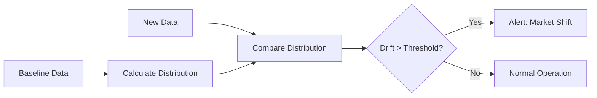
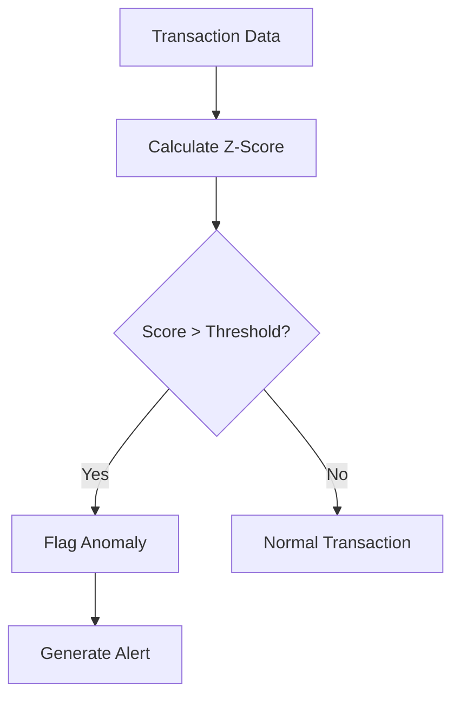

# AI Collaborative Platform - Real Estate Analytics Functional Specification

## Product Overview
A real-time analytics platform designed for UAE real estate and fintech companies (e.g., Stake, Ziina) to monitor property valuations and transactions for market shifts and anomalies.

## User Personas

### Primary Users
1. **Real Estate Analysts**
   - Needs: Market trend monitoring, valuation verification
   - Goals: Identify market shifts, validate property prices
   - Pain Points: Manual data analysis, delayed insights

2. **Risk Managers**
   - Needs: Anomaly detection, quick alerts
   - Goals: Prevent fraudulent transactions, maintain market integrity
   - Pain Points: False positives, delayed detection

### Secondary Users
1. **Data Scientists**
   - Needs: Raw data access, configuration flexibility
   - Goals: Model tuning, custom analysis
   - Pain Points: Data accessibility, processing limitations

## Functional Requirements

### 1. Data Loading Capabilities

#### File Upload
- **Standard Upload**
  - Supports CSV files up to 200MB
  - Progress indication
  - File validation
  - Error handling

- **Large File Processing**
  - Support for files >200MB
  - Chunk-based processing
  - Memory optimization
  - Progress tracking

#### Configuration Options
```python
{
    'method': ['Standard', 'Progressive', 'Large Data'],
    'chunk_size': int,  # Automatically optimized
    'file_path': str,   # Local or uploaded
}
```

### 2. Real-Time Monitoring

#### Drift Detection
- **Configuration**
  ```python
  {
      'threshold': 0.1,        # Default KL divergence threshold
      'window_size': 1000,     # Sliding window size
      'monitoring_col': str,   # Column to monitor
  }
  ```

- **Outputs**
  ```python
  {
      'drift_detected': bool,
      'drift_score': float,
      'timestamp': datetime,
  }
  ```

#### Anomaly Detection
- **Configuration**
  ```python
  {
      'zscore_threshold': 3.0,  # Standard deviations
      'alert_threshold': 10,    # Minimum anomalies for alert
  }
  ```

- **Outputs**
  ```python
  {
      'is_anomaly': bool,
      'score': float,
      'details': str,
  }
  ```

### 3. User Interface Components

#### Dashboard Layout
1. **Sidebar**
   - Data loading options
   - Configuration settings
   - System metrics

2. **Main Panel**
   - Real-time monitoring
   - Insights display
   - Export options

#### Interactive Elements
1. **Control Buttons**
   - Start Processing
   - Stop Processing
   - Clear Memory
   - Export Results

2. **Configuration Panels**
   - Drift threshold adjustment
   - Anomaly sensitivity
   - Column selection

### 4. Real Estate Insights

#### Market Analysis
```python
{
    'market_trends': {
        'status': str,     # 'Stable', 'Shifting'
        'details': str,    # Human-readable explanation
        'action': str,     # Recommended action
    },
    'price_anomalies': {
        'count': int,
        'details': str,
        'action': str,
    },
    'drift_analysis': {
        'status': str,
        'score': float,
        'action': str,
    }
}
```

#### Reporting Format
```csv
timestamp,market_status,details,anomalies,drift_score,recommendations
2025-02-24 12:00:00,Stable,Market aligned...,0,0.05,Continue monitoring
```

## Business Logic

### 1. Market Shift Detection


### 2. Anomaly Processing


## Error Handling

### User Feedback Messages
1. **Data Loading**
   - "⚠️ No CSV files found in uploads directory"
   - "✅ File loaded successfully"
   - "❌ Error loading file"

2. **Processing**
   - "📊 Establishing baseline..."
   - "⏳ Processing chunk X/Y"
   - "✅ Processing complete"

### Fallback Mechanisms
1. **Data Sources**
   - Primary: User uploaded data
   - Fallback: Synthetic data generation

2. **Processing**
   - Primary: Full dataset
   - Fallback: Chunked processing

## Performance Specifications

### Memory Management
- Target memory usage: <80% of available RAM
- Automatic chunk size optimization
- Garbage collection triggers

### Processing Speed
- Target processing time: <5s per chunk
- Real-time update frequency: 1s
- Maximum file size: Limited by available RAM

## Integration Guidelines

### API Integration
```python
def fetch_data():
    """Mock API call structure"""
    return {
        "price": float,
        "timestamp": datetime,
        "location": str,
        "type": str
    }
```

### Export Integration
```python
def export_report():
    """Report structure"""
    return {
        "metrics": dict,
        "insights": dict,
        "recommendations": list
    }
```

## Success Metrics
1. **System Performance**
   - Processing speed
   - Memory efficiency
   - Error rate

2. **Business Value**
   - Anomaly detection accuracy
   - Market shift prediction
   - User engagement

## Future Enhancements
1. Real API integration
2. Machine learning models
3. Advanced visualizations
4. Custom metrics 